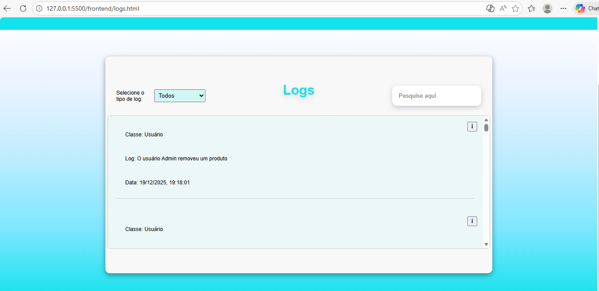
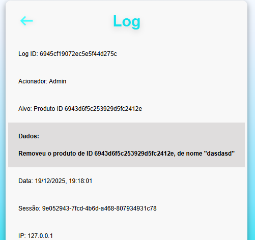
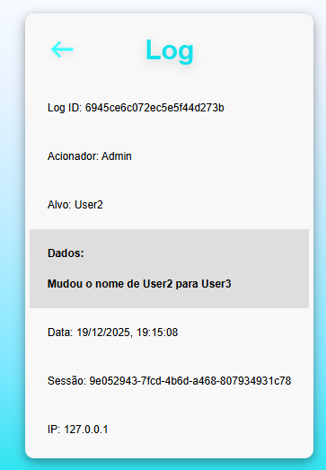
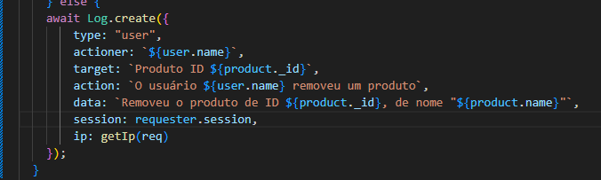
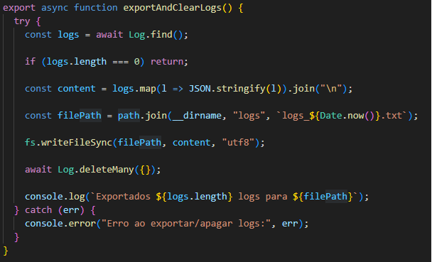
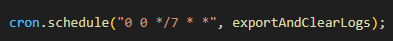

# mySimple Panel project — BETA 0.5v

Relatório de atualização do projeto pra nova versão 0.5, contando com features novos

# Introdução

Hoje venho trazer essa atualização simples, e agora o sistema conta com um sistema básico de auditoria em logs.

# Sistema de logs

Foi implementada na aba administrativa a verificação de logs dos eventos do sistema, incluindo login, logout, eventos como adição/edição de produtos e eventos administrativos como ediçao/remoção de usuários.

# Lógica

A lógica principal foi a criação da collection "Logs" no database, e uma distribuição de criações de Documents em todas as ações de requisição.

Exemplo:

Tentei detalhar o máximo de informações possíveis em cada log. Pra gerência dispomos de um controller no backend, onde recebemos requisições do front pra poder listar na página administrativa de logs.

Pensando em escalabilidade, implementei através das libs "path" e "fs" um processo de exportação e limpeza dos logs no database. O servidor chama essa função a cada 7 dias, evitando o acúmulo massivo de logs no database. 

E finalmente, através da lib "node-cron" o servidor contabiliza o tempo de 7 dias pra apagar os logs. 

Agora a meta é implementar o ultimo passo, integração de API's externas pra poder concluir esse projetinho e passar pro próximo.

# Roadmap atual

 [x] CRUD completo de produtos
 [x] Implementar roles simples: user / admin
 [x] Criar um sistema de logs/rastreamento de IP
 [] Implementar API's de pagamento sandbox e de email(verificação de código para mudança de senha/cadastro)

